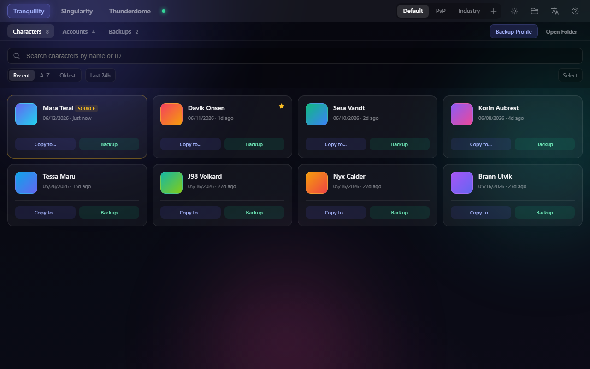
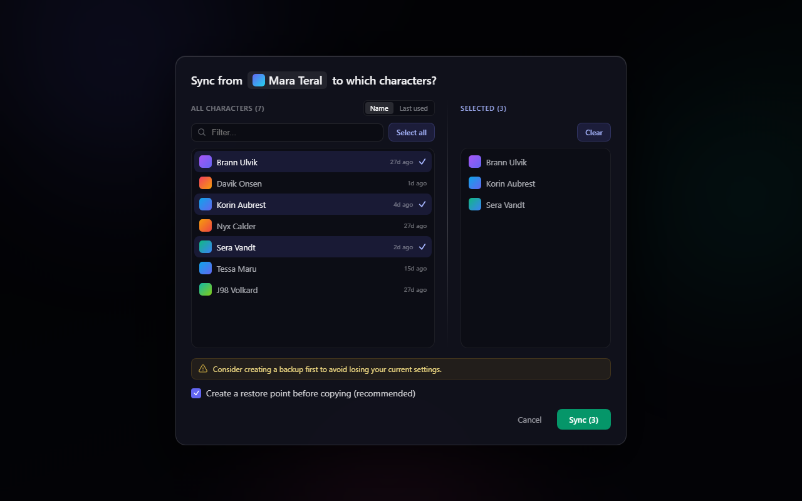
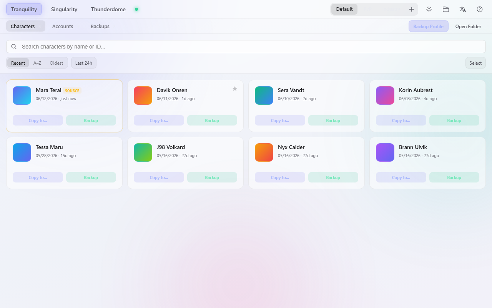

<h1 align="center">EVE Settings Manager</h1>

<p align="center">
  A desktop app for managing your local EVE Online settings files —<br>
  copy UI layouts between characters, back up profiles, and keep notes on accounts,<br>
  all without touching the game client.
</p>

<p align="center">
  <em>A redesigned fork with a modern glassmorphism interface and a reworked, safety-first workflow.</em>
</p>

<p align="center">
  <a href="https://github.com/talynorbealish/eve-settings-manager/releases/latest"><strong>⬇ Download</strong></a>
</p>

---



---

## Contents

- [What it does](#what-it-does)
- [Getting started](#getting-started)
- [Using the app](#using-the-app)
  - [Selecting the settings folder](#selecting-the-settings-folder)
  - [Characters](#characters)
  - [Copying settings between characters](#copying-settings-between-characters)
  - [Accounts](#accounts)
  - [Backups](#backups)
  - [Themes](#themes)
- [Data & privacy](#data--privacy)
- [Building from source](#building-from-source)
- [Credits & attribution](#credits--attribution)
- [Disclaimer](#disclaimer)
- [License](#license)

---

## What it does

EVE Online stores each character's and account's UI settings (window layouts, overview
presets, tabs, shortcuts, and so on) in local `.dat` files. Configuring them one character
at a time in-game is tedious — especially if you fly many alts.

This app lets you set things up **once** on a "master" character and then copy that layout
to as many other characters as you like, with a backup safety net so you can always undo.

Key features:

- **Character grid** with portraits, sorted by most-recently-used, plus search, sort, and a "last 24 h" filter.
- **Copy settings** from one character (or account) to many, with a searchable two-panel picker.
- **Safety first** — an automatic restore point is taken before every copy, and any copy can be undone with one click.
- **Favorites & source pinning** so your master characters stay at the top.
- **Copy sets** — save a named group of recipients and reapply it in one click.
- **Profiles, accounts notes, and backups** with rename and "where it came from" labels.
- **Light & dark glassmorphism themes** that remember your choice.

---

## Getting started

1. Download the latest build from the
   [**Releases page**](https://github.com/talynorbealish/eve-settings-manager/releases/latest)
   (or [build from source](#building-from-source)).
   - **Windows** — `.exe`, runs directly, no installation needed. *(Currently the prebuilt download.)*
   - **macOS** — `.dmg`, open and drag to Applications. *(Build from source for now.)*
   - **Linux** — `.AppImage`, make executable and run. *(Build from source for now.)*
2. Launch the app. It will try to find your EVE settings folder automatically.
3. Pick a server and profile at the top, then start managing your characters.

> **Windows note:** the build is not code-signed, so on first launch SmartScreen may show
> "Windows protected your PC". Click **More info → Run anyway** to continue.

> **macOS note:** if macOS reports the app is "damaged and can't be opened" (it is not
> code-signed), run this once in Terminal and then open it normally:
> ```bash
> xattr -cr "/Applications/EVE Settings Manager.app"
> ```

---

## Using the app

### Selecting the settings folder

On launch the app looks for your EVE settings folder automatically. If it isn't found, or
you want to point it elsewhere, use the **folder** icon in the top-right and pick the
location manually. You can select either the top-level game folder or a specific server
subfolder — the app figures out the rest.

**Default locations**

| Platform | Default path |
|---|---|
| macOS | `~/Library/Application Support/CCP/EVE` |
| Windows | `%LOCALAPPDATA%\CCP\EVE` |
| Linux | varies by Wine / Proton prefix |

The top bar lets you switch **servers** (Tranquility, Singularity, etc.) and **profiles**
(Default, and any custom profiles you create). The colored dot next to a server shows its
live online status. Right-click a profile tab to rename, duplicate, or delete it.

### Characters

The **Characters** tab shows every character in the selected profile as a card with their
portrait and when their settings were last modified.

- **Search** by name or ID with the box at the top (it stays pinned as you scroll).
- **Sort** by Recent, A–Z, or Oldest, and optionally filter to those changed in the last 24 hours.
- **Star** a character to pin it to the top as a favorite "source".
- Hover a card for **Copy to…** and **Backup** actions.
- Click **Select** to enter multi-select mode and back up several characters at once.

### Copying settings between characters

Click **Copy to…** on the character whose settings you want to share. The dialog asks
**"Sync from `<character>` to which characters?"**



- The **left** list is everyone you can copy to — searchable and sortable by name or last used.
- The **right** list summarizes who you've selected; remove individuals or **Clear** all.
- **Create a restore point before copying** is on by default — it snapshots the whole
  profile first so nothing is lost.
- After the copy, a toast appears with an **Undo** button to instantly roll it back.
- Save a frequently used group of recipients as a **Copy set** to reapply later.

### Accounts

The **Accounts** tab lists your account settings files. EVE doesn't expose account login
names anywhere in the local files (they live only on Fenris Creations' servers), so each account shows
its ID by default — but you can type a **friendly name/label** on each one, which is then
used throughout the app. The same Copy to… / Backup actions are available here.

### Backups

The **Backups** tab lists every backup you've made, newest first. Each backup shows when it
was created and which server/profile it came from. You can **restore**, **rename**, **reveal
in folder**, or **delete** any backup. Automatic restore points created before a copy show up
here too.

### Themes

Use the **sun/moon** icon in the top-right to switch between dark and light glassmorphism
themes. Your choice is remembered between launches.



---

## Data & privacy

Everything is stored locally — nothing is sent to any server. The only network calls are
character-name lookups against the official EVE ESI API, which contain no personal data.

| Platform | Local app data |
|---|---|
| macOS | `~/Library/Application Support/eve-settings-manager/` |
| Windows | `%APPDATA%\eve-settings-manager\` |
| Linux | `~/.config/eve-settings-manager/` |

---

## Building from source

**Prerequisites:** Node.js 18+, [pnpm](https://pnpm.io/).

```bash
git clone https://github.com/talynorbealish/eve-settings-manager.git
cd eve-settings-manager
pnpm install
pnpm dev        # dev server + Electron with hot reload
pnpm build      # type-check, bundle, and package a distributable
pnpm test       # run the automated test suite
```

The stack is **Electron + Vue 3 + Vite + TypeScript**, with **Tailwind CSS** for the
interface and **Pinia** for state. All filesystem work happens in the Electron main process
and is exposed to the renderer over typed IPC channels.

---

## Credits & attribution

This is a redesigned fork of the excellent
**[eve-settings-manager](https://github.com/mintnick/eve-settings-manager) by
[@mintnick](https://github.com/mintnick)**. All of the original concept and the underlying
settings-management engine are their work — this fork focuses on a new interface and an
expanded, safety-oriented workflow. Huge thanks to mintnick (and
[@Bombe](https://github.com/Bombe), credited in the original) for the foundation.

---

## Disclaimer

EVE Online® and all related names, logos, and assets are the property of Fenris Creations
(formerly CCP Games). This is an unofficial, fan-made tool and is not affiliated with or
endorsed by Fenris Creations.

---

## License

MIT — see [LICENSE](LICENSE).
